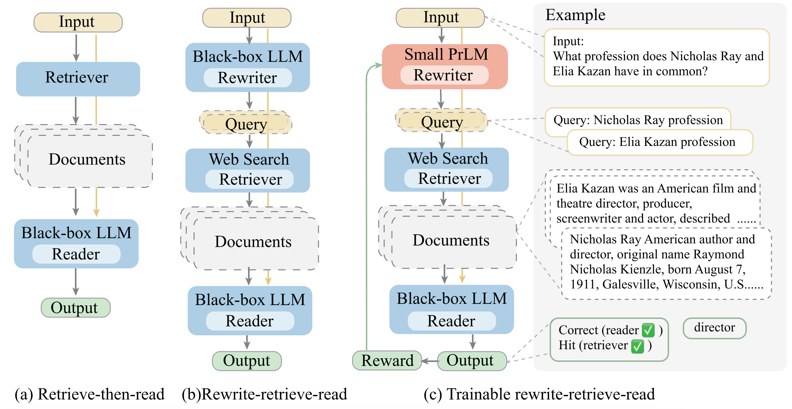

# RAG-query-rewriting

### Paper: Query Rewriting in Retrieval-Augmented Large Language Models [[pdf]](https://arxiv.org/abs/2305.14283)

Large Language Models (LLMs) play powerful, black-box readers in the retrieve-then-read pipeline, making remarkable progress in knowledge-intensive tasks. This work introduces a new framework, Rewrite-Retrieve-Read instead of the previous retrieve-then-read for the retrieval-augmented LLMs from the perspective of the query rewriting. We first prompt an LLM to generate the query, then use a web search engine to retrieve contexts. Furthermore, to better align the query to the frozen modules, we propose a trainable scheme for our pipeline. A small language model is adopted as a trainable rewriter to cater to the black-box LLM reader. The rewriter is trained using the feedback of the LLM reader by reinforcement learning.



### Acknowledgement

Many thanks to

[GenRead](https://github.com/wyu97/GenRead): Generate rather than retrieve: Large language models are strong context generators

[ReAct](https://github.com/ysymyth/ReAct): ReAct: Synergizing Reasoning and Acting in Language Models

[RL4LM](https://github.com/allenai/RL4LMs): Is Reinforcement Learning (Not) for Natural Language Processing?: Benchmarks, Baselines, and Building Blocks for Natural Language Policy Optimization

Also, [Vicuna](https://vicuna.lmsys.org/), [Bing](https://learn.microsoft.com/en-us/bing/search-apis/), [Openai](https://openai.com/).

```
@article{ma2023query,
  title={Query Rewriting for Retrieval-Augmented Large Language Models},
  author={Ma, Xinbei and Gong, Yeyun and He, Pengcheng and Zhao, Hai and Duan, Nan},
  journal={arXiv preprint arXiv:2305.14283},
  year={2023}
}
```