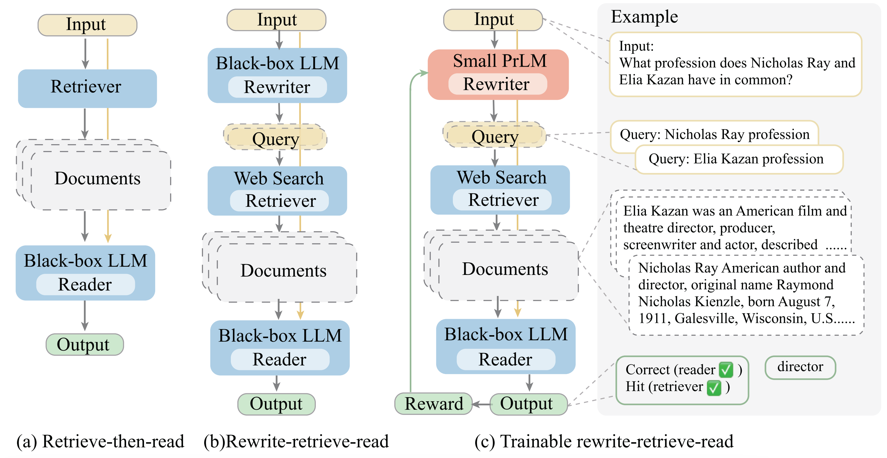

# RAG-query-rewriting

### Paper: Query Rewriting in Retrieval-Augmented Large Language Models [[pdf]](https://arxiv.org/abs/2305.14283)

大型语言模型 （LLM） 在 retrieve-then-read 的流程中扮演强大的黑盒reader，在知识密集型任务中取得了显著进展。从查询重写的角度来看，这项工作引入了一个新的框架，Rewrite-Retrieve-Read，而不是以前的 retrieve-then-read ，用于检索增强的 LLM。我们首先提示 LLM 生成查询，然后使用 Web 搜索引擎检索上下文。此外，为了更好地将查询与冻结的模块对齐，我们在整个流程中提出了一个可训练的方案。采用小型语言模型作为可训练的重写器，以迎合黑盒 LLM 阅读器。通过强化学习，使用 LLM reader的反馈来训练重写器。



此代码库将不断改进。

- Add prompt lines (*./generate/inprompts*), example results (*.examples*).
- Add result models (*./result_models*).

### Acknowledgement

Many thanks to

[GenRead](https://github.com/wyu97/GenRead): Generate rather than retrieve: Large language models are strong context generators

[ReAct](https://github.com/ysymyth/ReAct): ReAct: Synergizing Reasoning and Acting in Language Models

[RL4LM](https://github.com/allenai/RL4LMs): Is Reinforcement Learning (Not) for Natural Language Processing?: Benchmarks, Baselines, and Building Blocks for Natural Language Policy Optimization

Also, [Vicuna](https://vicuna.lmsys.org/), [Bing](https://learn.microsoft.com/en-us/rest/api/cognitiveservices-bingsearch/bing-web-api-v7-reference), [Openai](https://openai.com/).

```
@inproceedings{ma-etal-2023-query,
    title = "Query Rewriting in Retrieval-Augmented Large Language Models",
    author = "Ma, Xinbei  and
      Gong, Yeyun  and
      He, Pengcheng  and
      Zhao, Hai  and
      Duan, Nan",
    editor = "Bouamor, Houda  and
      Pino, Juan  and
      Bali, Kalika",
    booktitle = "Proceedings of the 2023 Conference on Empirical Methods in Natural Language Processing",
    month = dec,
    year = "2023",
    address = "Singapore",
    publisher = "Association for Computational Linguistics",
    url = "https://aclanthology.org/2023.emnlp-main.322",
    doi = "10.18653/v1/2023.emnlp-main.322",
    pages = "5303--5315",
    abstract = "Large Language Models (LLMs) play powerful, black-box readers in the retrieve-then-read pipeline, making remarkable progress in knowledge-intensive tasks. This work introduces a new framework, Rewrite-Retrieve-Read instead of the previous retrieve-then-read for the retrieval-augmented LLMs from the perspective of the query rewriting. Unlike prior studies focusing on adapting either the retriever or the reader, our approach pays attention to the adaptation of the search query itself, for there is inevitably a gap between the input text and the needed knowledge in retrieval. We first prompt an LLM to generate the query, then use a web search engine to retrieve contexts. Furthermore, to better align the query to the frozen modules, we propose a trainable scheme for our pipeline. A small language model is adopted as a trainable rewriter to cater to the black-box LLM reader. The rewriter is trained using the feedback of the LLM reader by reinforcement learning. Evaluation is conducted on downstream tasks, open-domain QA and multiple-choice QA. Experiments results show consistent performance improvement, indicating that our framework is proven effective and scalable, and brings a new framework for retrieval-augmented LLM.",
}
```
